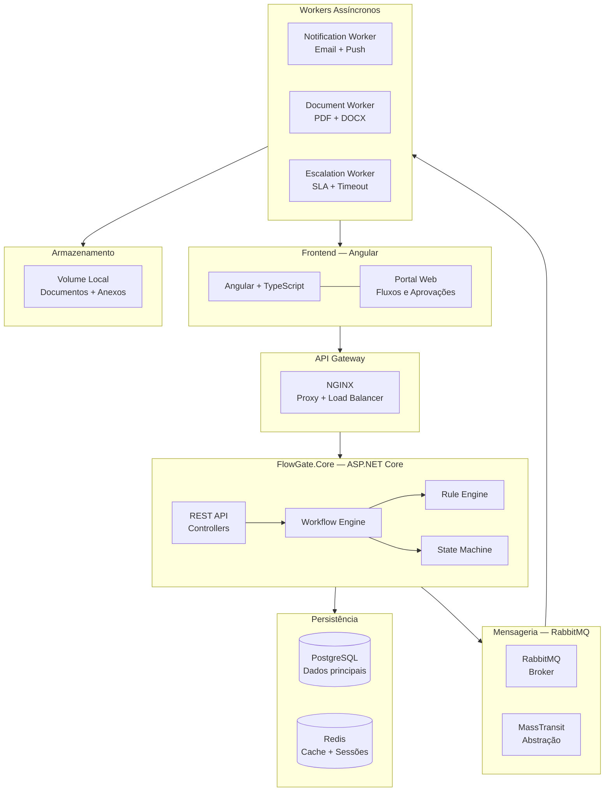
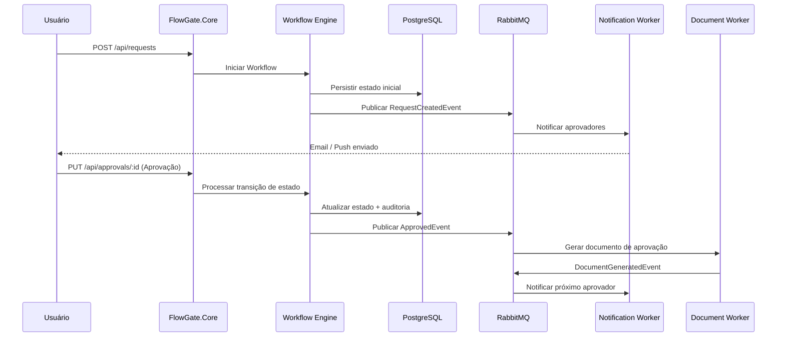
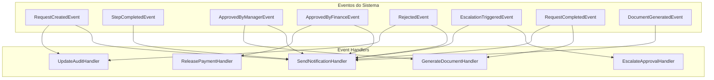
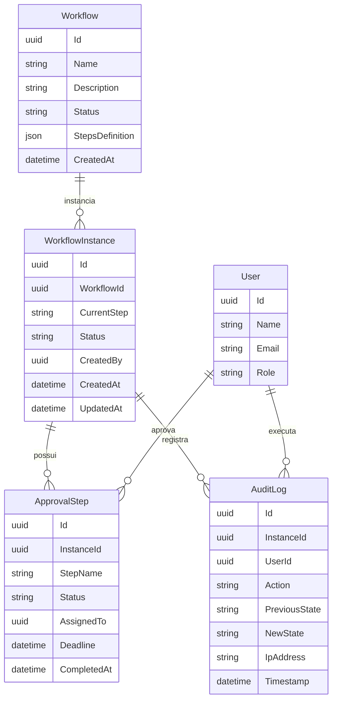
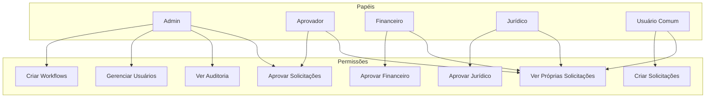

# FlowGate — Arquitetura Técnica

## Stack

| Camada | Tecnologias |
|--------|------------|
| **Backend** | C#, ASP.NET Core, Entity Framework Core, MassTransit |
| **Frontend** | Angular, TypeScript, SCSS |
| **Mensageria** | RabbitMQ |
| **Banco principal** | PostgreSQL |
| **Cache** | Redis |
| **Armazenamento** | Volume Local (filesystem montado via Docker) |
| **Gateway** | NGINX |
| **Infra** | Docker, Docker Compose |

---

## Visão Geral do Sistema

---

## Fluxo de Dados

---

## Componentes do Backend

```mermaid
graph LR
    subgraph API["API Layer"]
        C[Controllers]
        MW[Middlewares\nAuth + Logging]
        V[Validators\nFluentValidation]
    end

    subgraph Core["Domain Layer"]
        WE[Workflow Engine]
        RE[Rule Engine]
        SM[State Machine]
        SLA[SLA Monitor]
    end

    subgraph Infra["Infrastructure Layer"]
        EF[EF Core\nRepositories]
        MT[MassTransit\nPublishers]
        RC[Redis Cache]
        FS[FileSystem\nLocal Volume]
    end

    subgraph Events["Event Handlers"]
        EH1[RequestCreatedHandler]
        EH2[ApprovedHandler]
        EH3[RejectedHandler]
        EH4[EscalationHandler]
        EH5[DocumentHandler]
    end

    API --> Core
    Core --> Infra
    Infra --> Events
```

---

## Estrutura de Eventos (Event-Driven)

---

## Arquitetura de Dados

---

## Permissões (RBAC)

---

## Navegação

- [Overview](01-overview.md)
- [Workflow Engine](03-workflow-engine.md)
- [Funcionalidades](04-features.md)
- [Casos de Uso](05-use-cases.md)
