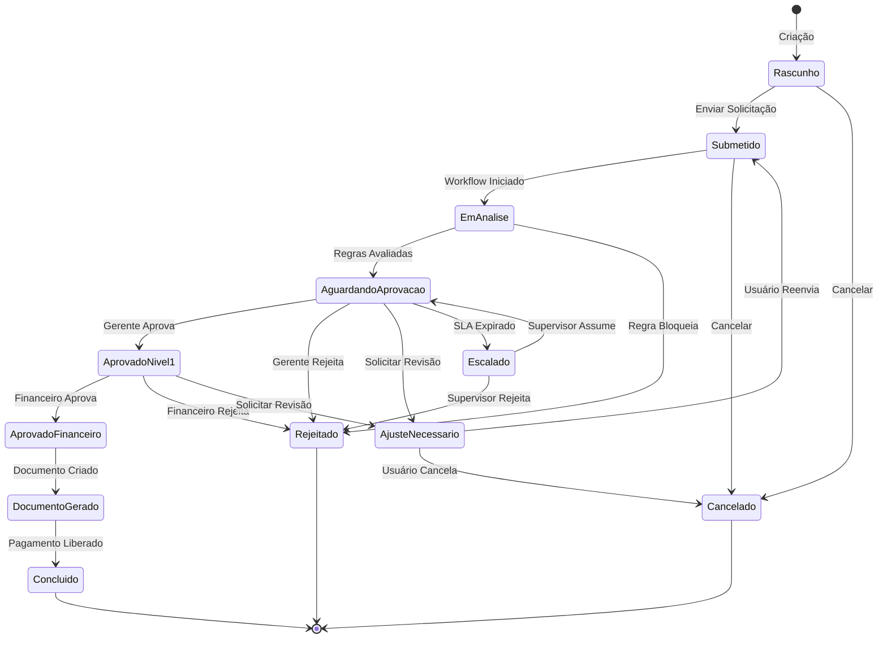
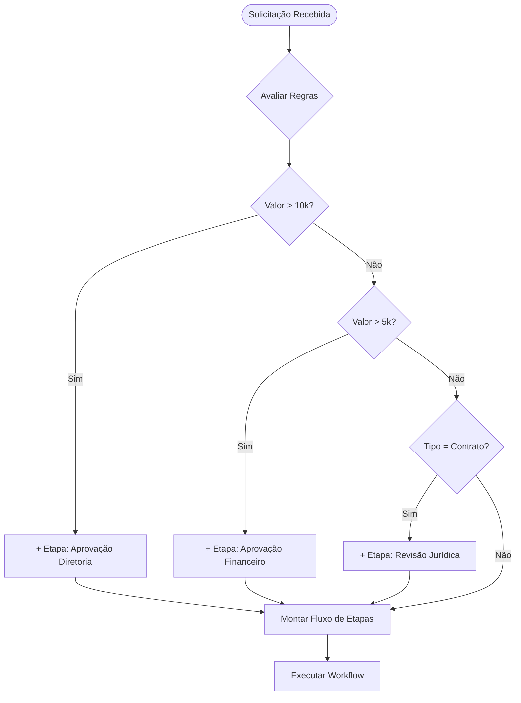
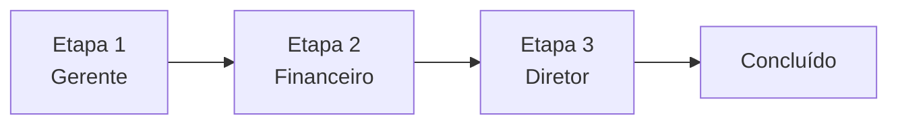
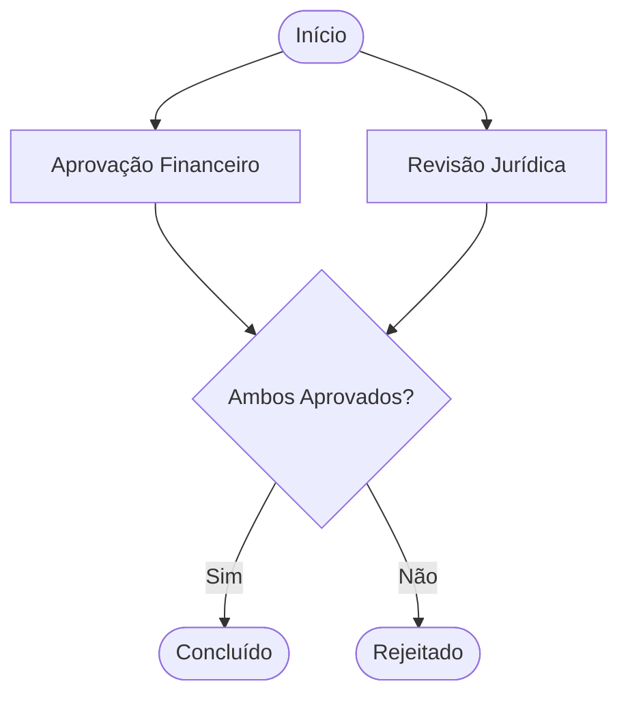
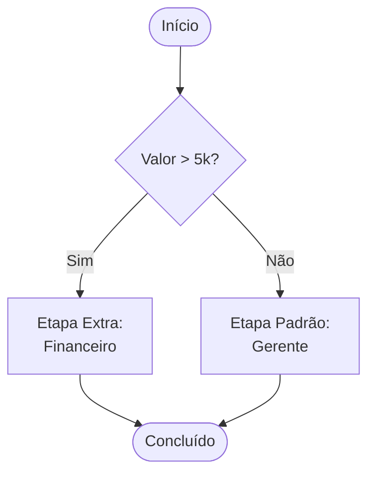
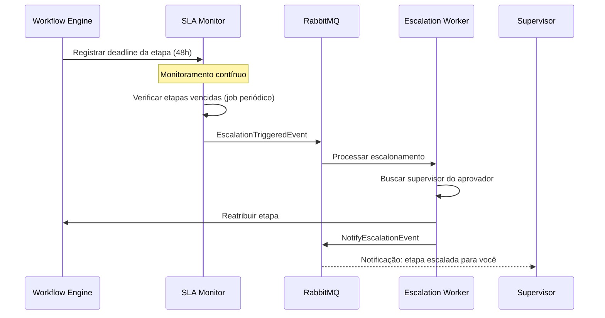
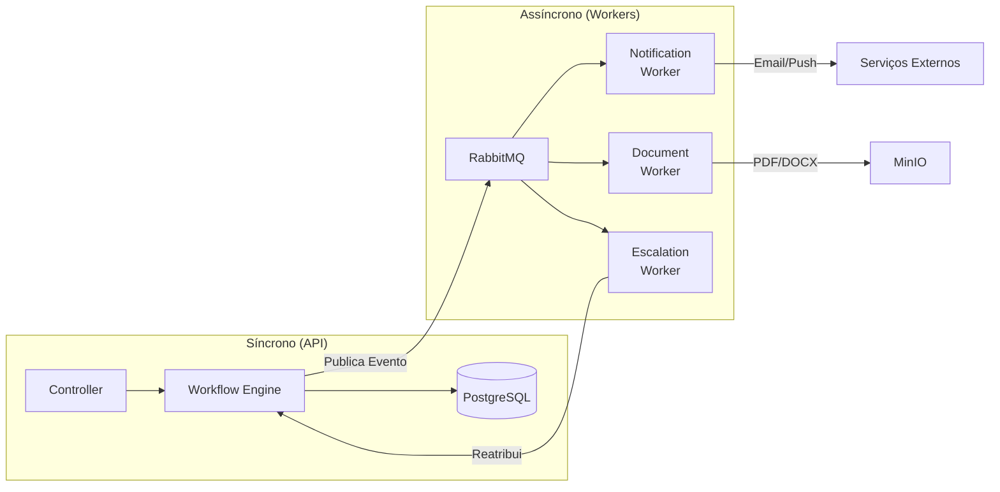

# FlowGate — Workflow Engine

## O que é o Workflow Engine

O **Workflow Engine** é o coração do FlowGate. É um motor genérico responsável por:

- Instanciar e executar workflows configuráveis
- Controlar o ciclo de vida de cada solicitação
- Orquestrar etapas, dependências e aprovações
- Aplicar regras condicionais via Rule Engine
- Gerenciar transições de estado via State Machine
- Disparar eventos para processamento assíncrono

---

## State Machine — Ciclo de Vida de uma Solicitação



---

## Rule Engine — Regras Condicionais

O **Rule Engine** avalia regras dinâmicas para determinar:

- Quais etapas são necessárias
- Quem deve aprovar
- Se exige documentação adicional
- Se pode seguir em paralelo

### Exemplo de Regras (pseudocódigo SDD)

```
DADO uma solicitação de reembolso com valor > 5.000
QUANDO for submetida
ENTÃO exigir aprovação do Financeiro

DADO uma solicitação de reembolso com valor > 10.000
QUANDO for submetida
ENTÃO exigir aprovação do Diretor

DADO uma solicitação de contrato com valor > 50.000
QUANDO for aprovada pelo Financeiro
ENTÃO encaminhar para o Jurídico

DADO uma solicitação parada na etapa de aprovação por mais de 48h
QUANDO o SLA expirar
ENTÃO escalar para o supervisor do aprovador
```

### Fluxo do Rule Engine



---

## Orquestração de Etapas

O engine suporta diferentes modos de execução:

### Sequencial



### Paralelo



### Com Condição



---

## SLA e Escalonamento



---

## Spec-Driven Development (SDD)

O FlowGate usa **SDD com OpenSpec** — toda regra de negócio nasce como uma especificação comportamental antes de ser implementada.

### Formato de Especificação

```gherkin
Feature: Aprovação de Reembolso Corporativo

  Scenario: Reembolso abaixo de 5.000 reais
    Given um funcionário submete reembolso de R$ 3.000
    When o workflow é iniciado
    Then apenas o gerente direto deve aprovar
    And o prazo de aprovação é de 48 horas

  Scenario: Reembolso acima de 5.000 reais
    Given um funcionário submete reembolso de R$ 7.000
    When o workflow é iniciado
    Then o gerente direto deve aprovar primeiro
    And o financeiro deve aprovar em seguida
    And o prazo total é de 72 horas

  Scenario: Reembolso acima de 10.000 reais
    Given um funcionário submete reembolso de R$ 12.000
    When o workflow é iniciado
    Then o gerente direto deve aprovar
    And o financeiro deve aprovar
    And o diretor deve aprovar por último
    And qualquer rejeição encerra o fluxo

  Scenario: SLA expirado sem aprovação
    Given uma etapa está pendente há mais de 48 horas
    When o SLA monitor verifica as etapas
    Then a etapa é escalada para o supervisor do aprovador
    And o aprovador original é notificado
    And o supervisor recebe notificação de urgência
```

---

## Processamento Assíncrono



### Eventos do Sistema

| Evento | Produzido por | Consumido por |
|--------|--------------|--------------|
| `RequestCreatedEvent` | Workflow Engine | Notification Worker |
| `StepAssignedEvent` | Workflow Engine | Notification Worker |
| `ApprovedEvent` | Workflow Engine | Notification + Document Worker |
| `RejectedEvent` | Workflow Engine | Notification Worker + Audit |
| `EscalationTriggeredEvent` | SLA Monitor | Escalation Worker |
| `RequestCompletedEvent` | Workflow Engine | Document + Notification Worker |
| `DocumentGeneratedEvent` | Document Worker | Notification Worker |

---

## Navegação

- [Overview](01-overview.md)
- [Arquitetura](02-architecture.md)
- [Funcionalidades](04-features.md)
- [Casos de Uso](05-use-cases.md)
