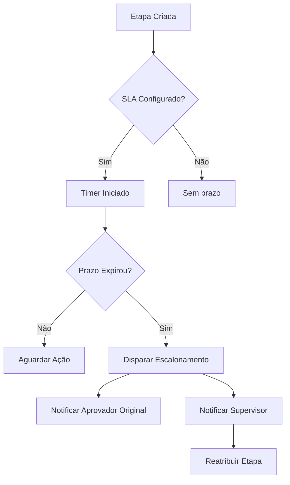
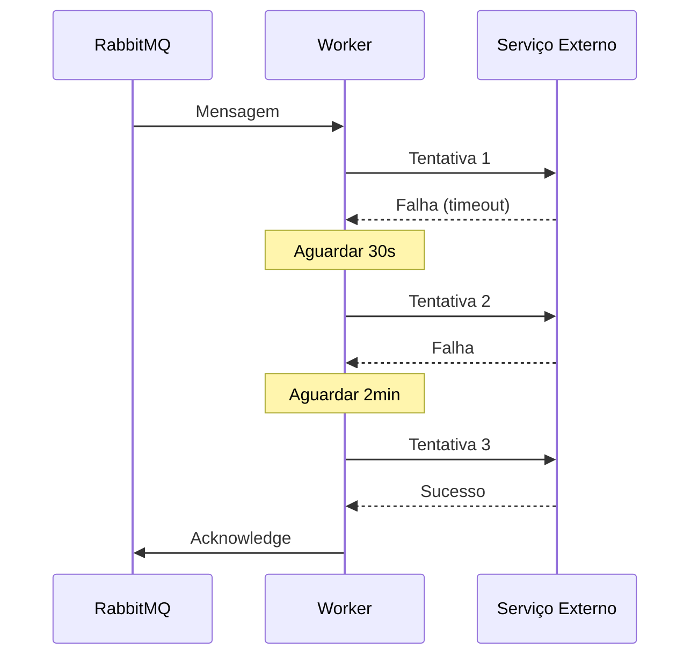

# FlowGate — Funcionalidades

## 1. Workflow Engine

Motor central do sistema, responsável por toda a orquestração de processos.

| Funcionalidade | Descrição |
|----------------|-----------|
| Criação de workflows dinâmicos | Workflows configuráveis sem necessidade de código |
| Execução de etapas | Controle de início, progresso e conclusão de cada etapa |
| Controle de transições | Transições de estado baseadas em ações e regras |
| Persistência de estado | Estado completo salvo em banco para retomada e auditoria |
| Etapas sequenciais | Uma etapa após a outra, em ordem definida |
| Etapas paralelas | Múltiplas etapas executando simultaneamente |
| Etapas condicionais | Etapas incluídas ou excluídas por regras dinâmicas |

---

## 2. Rule Engine

Motor de regras responsável por decisões dinâmicas e configuráveis.

| Funcionalidade | Descrição |
|----------------|-----------|
| Regras condicionais | `SE condição ENTÃO ação` |
| Validações dinâmicas | Validação de dados da solicitação em tempo de execução |
| Decisões automáticas | Engine decide próximo passo sem intervenção humana |
| Regras compostas | Múltiplas condições combinadas com AND/OR |
| Regras por tipo de processo | Regras específicas por categoria de workflow |

### Exemplo de Regras

```
SE valor > 5.000  → adicionar etapa: Aprovação Financeiro
SE valor > 10.000 → adicionar etapa: Aprovação Diretoria
SE tipo = contrato AND valor > 50.000 → adicionar etapa: Revisão Jurídica
SE país != Brasil → adicionar etapa: Compliance Internacional
```

---

## 3. Aprovações

Sistema flexível de aprovações com suporte a múltiplos fluxos.

| Tipo | Descrição |
|------|-----------|
| **Aprovação Simples** | Um único aprovador decide |
| **Aprovação em Cadeia** | Aprovadores sequenciais, cada um após o anterior |
| **Aprovação Paralela** | Múltiplos aprovadores simultâneos, todos devem aprovar |
| **Aprovação por Quórum** | Maioria dos aprovadores deve concordar |
| **Rejeição** | Qualquer aprovador pode rejeitar e encerrar o fluxo |
| **Solicitação de Ajuste** | Aprovador pede revisão sem rejeitar definitivamente |

---

## 4. SLA e Escalonamento



| Configuração | Descrição |
|--------------|-----------|
| Prazo por etapa | SLA individual para cada etapa do workflow |
| Prazo total | SLA do processo completo |
| Escalonamento automático | Reatribuição para supervisor ao expirar |
| Notificação de urgência | Alertas antes do prazo expirar (ex: 12h antes) |
| Retry automático | Reenvio de notificações periódicas |

---

## 5. Auditoria

Registro completo e imutável de todas as ações do sistema.

| Campo registrado | Descrição |
|-----------------|-----------|
| Usuário | Quem executou a ação |
| Data e Hora | Timestamp preciso com timezone |
| IP | Endereço IP da requisição |
| Ação | O que foi feito (aprovação, rejeição, etc.) |
| Estado anterior | Estado antes da ação |
| Estado novo | Estado após a ação |
| Dados alterados | Delta das mudanças realizadas |
| Comentário | Observação deixada pelo usuário |

---

## 6. Processamento Assíncrono

Uso de filas para operações pesadas e não-bloqueantes.

| Worker | Responsabilidade |
|--------|-----------------|
| **Notification Worker** | Envio de emails, push notifications e webhooks |
| **Document Worker** | Geração de PDFs, DOCX e documentos com templates |
| **Escalation Worker** | Monitoramento de SLA e escalonamento automático |

### Retries Automáticos



---

## 7. Geração de Documentos

| Funcionalidade | Descrição |
|----------------|-----------|
| PDF | Geração de documentos PDF com layout customizado |
| DOCX | Documentos Word editáveis |
| Templates dinâmicos | Preenchimento automático com dados do workflow |
| QRCode de validação | QRCode único para verificar autenticidade do documento |
| Armazenamento | Documentos salvos em volume local (filesystem montado via Docker) |
| Versionamento | Múltiplas versões de um mesmo documento |

---

## 8. Permissões (RBAC)

| Papel | Permissões |
|-------|-----------|
| **Admin** | Tudo: gerenciar usuários, criar workflows, ver auditoria |
| **Aprovador** | Aprovar/rejeitar solicitações atribuídas a ele |
| **Financeiro** | Aprovações financeiras e acesso a relatórios financeiros |
| **Jurídico** | Aprovações jurídicas e revisão de contratos |
| **Usuário Comum** | Criar solicitações e acompanhar as próprias |

---

## 9. Notificações

| Canal | Exemplos |
|-------|---------|
| Email | Solicitação criada, aprovação pendente, prazo próximo |
| Push (web) | Alertas em tempo real no painel |
| Webhook | Integração com sistemas externos (Slack, Teams, etc.) |

---

## 10. Tipos de Workflow Suportados

| Tipo | Descrição |
|------|-----------|
| Aprovação de compras | Requisições de compra com limites por alçada |
| Reembolso corporativo | Reembolso de despesas com comprovantes |
| Gestão de contratos | Revisão e aprovação de contratos |
| Onboarding | Admissão de funcionários com múltiplas etapas de RH |
| Férias | Solicitação e aprovação de períodos de férias |
| Cadastro de fornecedores | Due diligence e aprovação de novos fornecedores |
| Validação documental | Conferência e aprovação de documentos enviados |

---

## Navegação

- [Overview](01-overview.md)
- [Arquitetura](02-architecture.md)
- [Workflow Engine](03-workflow-engine.md)
- [Casos de Uso](05-use-cases.md)
