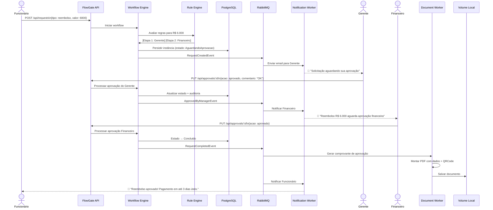
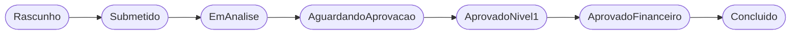
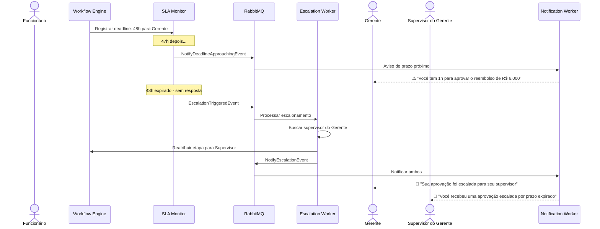
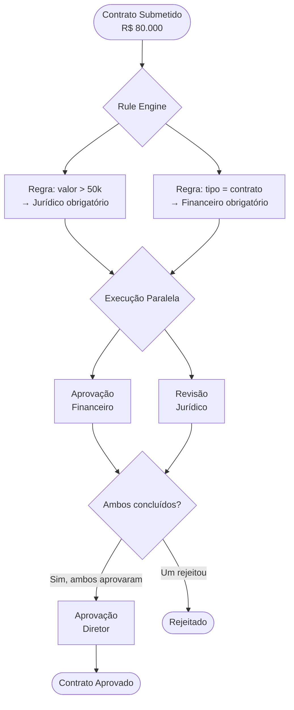
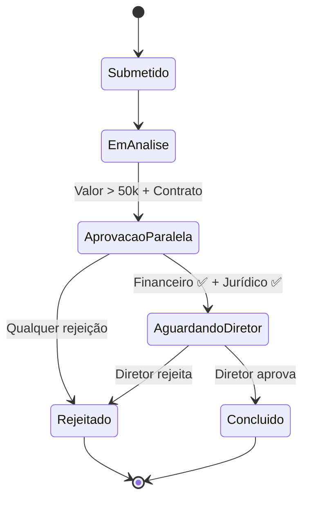
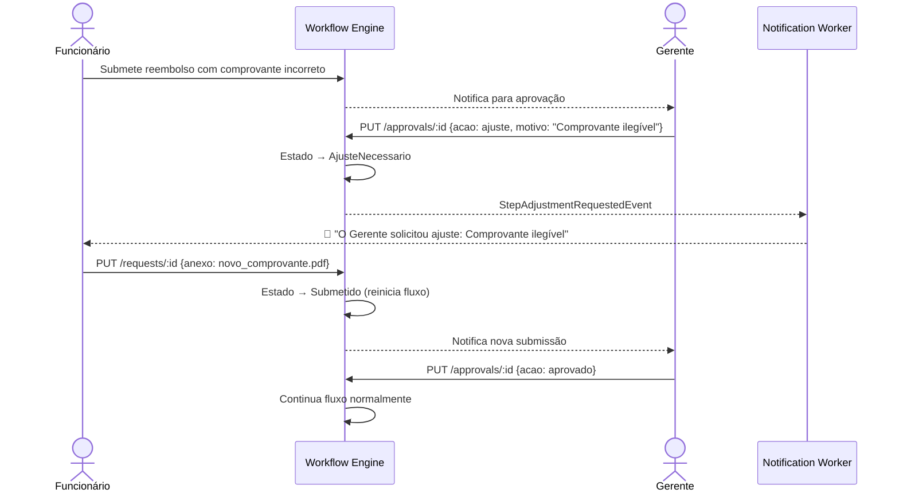
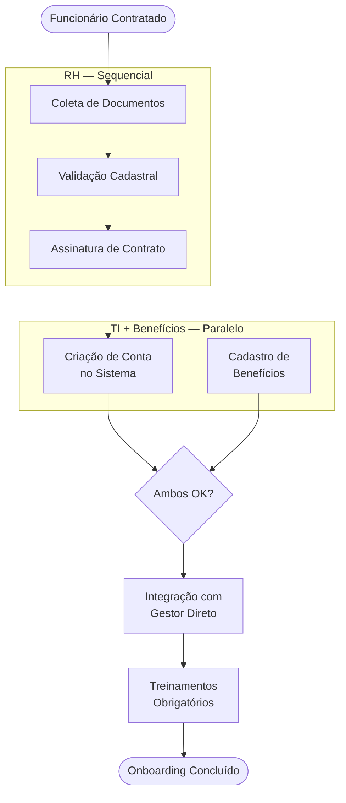

# FlowGate — Casos de Uso

## Caso 1: Reembolso Corporativo

### Contexto

Um funcionário realizou uma despesa de R$ 6.000 em uma viagem corporativa e precisa solicitar reembolso.

### Fluxo Completo



### Regras Aplicadas

| Regra | Valor | Resultado |
|-------|-------|-----------|
| `valor > 5.000` | R$ 6.000 ✅ | Exige aprovação do Financeiro |
| `valor > 10.000` | R$ 6.000 ❌ | Não exige aprovação do Diretor |

### Estados percorridos



---

## Caso 2: Reembolso com SLA Expirado

### Contexto

O mesmo reembolso, mas o Gerente não responde em 48h.



---

## Caso 3: Aprovação de Contrato (Paralela)

### Contexto

Um contrato de R$ 80.000 precisa de aprovação simultânea do Financeiro e do Jurídico.



### Estados percorridos



---

## Caso 4: Solicitação com Pedido de Ajuste

### Contexto

Funcionário submete reembolso com comprovante incorreto. Gerente pede revisão.



---

## Caso 5: Onboarding de Funcionário

### Contexto

Novo funcionário contratado precisa passar por múltiplas etapas de RH, TI e Gestão.



### Especificação SDD

```gherkin
Feature: Onboarding de Novo Funcionário

  Scenario: Onboarding padrão CLT
    Given um funcionário CLT é cadastrado no sistema
    When o onboarding é iniciado
    Then o RH deve coletar documentos em até 24 horas
    And o contrato deve ser assinado em até 48 horas
    And TI e Benefícios são ativados em paralelo
    And o gestor deve fazer a integração em até 5 dias úteis

  Scenario: Documentação incompleta
    Given o funcionário enviou documentos incompletos
    When o RH valida o cadastro
    Then o status muda para AjusteNecessario
    And o funcionário é notificado com a lista de pendências
    And o prazo é reiniciado após o reenvio
```

---

## Resumo dos Casos

| Caso | Tipo | Complexidade |
|------|------|-------------|
| Reembolso simples | Sequencial com regras de valor | ⭐⭐ |
| Reembolso com SLA | Sequencial + escalonamento | ⭐⭐⭐ |
| Contrato | Paralelo + múltiplos aprovadores | ⭐⭐⭐⭐ |
| Ajuste/Revisão | Sequencial com loop de correção | ⭐⭐⭐ |
| Onboarding | Misto (sequencial + paralelo) | ⭐⭐⭐⭐⭐ |

---

## Navegação

- [Overview](01-overview.md)
- [Arquitetura](02-architecture.md)
- [Workflow Engine](03-workflow-engine.md)
- [Funcionalidades](04-features.md)
